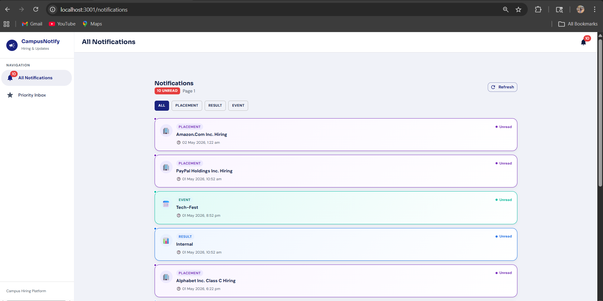
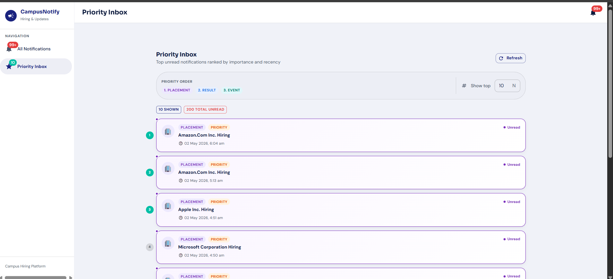

# CampusNotify

A robust, full-stack notification system built for campus hiring and updates. This project features a Next.js frontend integrated with Material UI, handling real-time data fetching, pagination, and intelligent priority-based sorting.

## 🚀 Features

- **Priority Inbox:** Intelligently sorts notifications based on Recency and Importance (Placement > Result > Event).
- **Categorization & Filtering:** Seamlessly filter notifications by types such as Placement, Event, and Result.
- **Pagination:** Handles large datasets efficiently with built-in, responsive pagination.
- **Secure Authentication:** Communicates securely with the `evaluation-service` backend using JWT Bearer tokens.
- **Responsive Design:** A beautiful, responsive interface crafted with Material UI (MUI) components.
- **Custom Hooks:** Clean and reusable React hooks (e.g., `useNotifications`) to manage asynchronous state and caching.

## 📸 Screenshots

*(Replace the placeholders below with your localhost screenshots)*

### All Notifications


### Priority Inbox


## 🛠️ Tech Stack

- **Framework:** [Next.js](https://nextjs.org/) (React)
- **Styling & UI:** [Material UI (MUI)](https://mui.com/) & Emotion
- **Date Formatting:** [date-fns](https://date-fns.org/)
- **State Management:** Custom React Context/Hooks

## ⚙️ Local Development Setup

Follow these instructions to run the application locally.

### 1. Clone the repository

```bash
git clone https://github.com/Swaroop2110/RA2311003011066.git
cd RA2311003011066/notification_app_fe
```

### 2. Install dependencies

```bash
npm install
```

### 3. Environment Variables

Create a `.env.local` file in the root of the `notification_app_fe` directory and add your backend API configuration and access token:

```env
NEXT_PUBLIC_API_BASE_URL=http://20.207.122.201/evaluation-service
NEXT_PUBLIC_AUTH_TOKEN=your_jwt_auth_token_here
```

### 4. Run the development server

```bash
npm run dev
```

The application should now be running on [http://localhost:3000](http://localhost:3000) (or whichever port Next.js assigns).

## 📂 Project Structure

- `notification_app_fe/api/` - API configuration and fetch utility methods.
- `notification_app_fe/components/` - Reusable UI elements (Header, Sidebar, FilterBar, PaginationBar, NotificationCard).
- `notification_app_fe/hooks/` - Custom React hooks for fetching and state.
- `notification_app_fe/pages/` - Application routes (Index, Notifications, Priority).
- `notification_app_fe/utils/` - Helper functions like `priorityHelper.js` to rank and sort notifications.
- `logging_middleware/` - Custom backend/frontend logging module (if applicable).

## 📝 License

This project is submitted for evaluation and is the property of the author.
